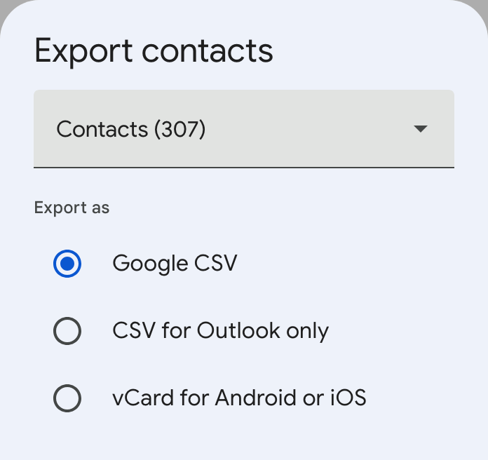

# Google contacts photo backup

Contacts must be exported in "Google CSV" format and saved in the `input` folder. See `example_contacts.csv` for an example of how the exported file should appear.

Run `main.py`. This will create the folder `contact_photos`, with the images saved using first and last name.
